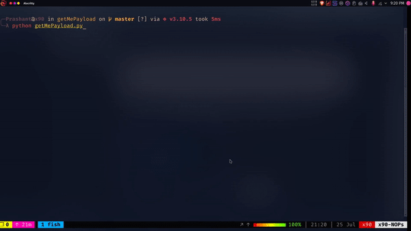

# GetMePayload

GetMePaylod a GUI tool to get you a paylod by scraping a popular github repo 'payloadallthings'.

## Installation

Install GetMePayload with terminal

```bash
  git clone https://github.com/softwarica-github/coursework1-prashantstha17
```
Run GetMePayload
```bash
  pip install -r requirements.txt
  python getmepayload.py  
```

## Tools Used

The tools I have used for this project are as shown below:

- [Tkinter](https://docs.python.org/3/library/tkinter.html)
- [CustomTkinter](https://github.com/TomSchimansky/CustomTkinter)
- [Requests](https://pypi.org/project/requests/)
- [BeautifulSoup](https://beautiful-soup-4.readthedocs.io/en/latest/)

## Demo

**Payload Demo**



  
<br>
<br>

# Links

The links you can go through:

- Repository: https://github.com/softwarica-github/coursework1-prashantstha17
- Youtube video: https://youtu.be/8ki22gB29P0


<br>
<br>


<p align="center"><b><u><i> Thank you!!. Stars are appreciated. </i></u></b><p>
